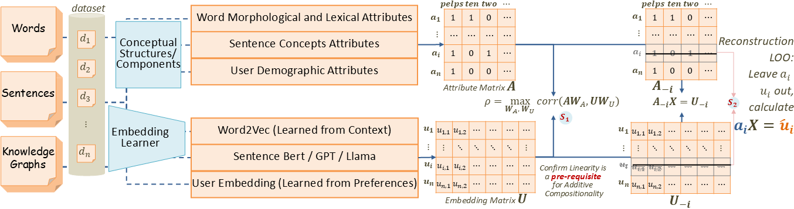

# Quantifying Compositionality in Embeddings

Implementation of **"Quantifying Compositionality of Classic and State-of-the-Art Embeddings"** - A framework for measuring compositional alignment between learned embeddings and structured attributes.

## 📊 Core Concept

For each entity (sentence/word/user), we have **TWO independent descriptions**:

1. **Embeddings** 📈 - Learned from distributional hypothesis (context/behavior)
   - Sentences → SBERT/GPT embeddings from contextual usage
   - Words → Word2Vec from co-occurrence patterns  
   - Users → Graph embeddings from interaction behavior

2. **Attributes** 🏷️ - Structured multi-hot vectors (demographics/syntax/concepts)
   - Sentences → Concept annotations (location, genre, etc.)
   - Words → Morphological features (prefixes, suffixes, roots)
   - Users → Demographics (age, gender, occupation)

**Our Goal**: Test if these two representations are compositionally aligned using:
- **CCA (Canonical Correlation Analysis)**: Measures linear correlation
- **Linear Decomposition**: Tests if embeddings can be reconstructed from attributes


*Figure: Two-step pipeline for quantifying compositionality between embeddings and attributes*

## 🚀 Quick Start

### Installation

```bash
# Clone repository
git clone https://github.com/yourusername/quantifying-compositionality.git
cd quantifying-compositionality

# Create virtual environment
python -m venv venv
source venv/bin/activate  # On Windows: venv\Scripts\activate

# Install dependencies
pip install -r requirements.txt
```

### Run Specific Experiments

```bash
# Choose which experiment to run:
python run_experiments.py --experiment sentence   # Sentence analysis only
python run_experiments.py --experiment word       # Word analysis only
python run_experiments.py --experiment kg         # KG analysis only (requires pre-trained embeddings)
python run_experiments.py --experiment layer-wise # Layer-wise SBERT analysis
python run_experiments.py --experiment all        # Run everything
```

### Basic Usage

```python
from attributes import SentenceAttributeExtractor
from embeddings import SentenceBERTExtractor
from compositionality import CompositionalityAnalyzer

# 1. Prepare your data
sentences = [
    "Book a table for dinner tomorrow",
    "Find flights from New York to London",
    "Show me movies playing tonight"
]

# 2. Extract attributes (structured representation)
attr_extractor = SentenceAttributeExtractor()
attributes, concept_names = attr_extractor.extract(sentences)

# 3. Generate embeddings (distributional representation)
embed_extractor = SentenceBERTExtractor()
embeddings = embed_extractor.extract(sentences)

# 4. Analyze compositionality
analyzer = CompositionalityAnalyzer()
results = analyzer.analyze_compositionality(embeddings, attributes)

print(f"Compositionality Score: {results['overall_compositionality_score']:.4f}")
```

## 📁 Project Structure

```
quantifying-compositionality/
│
├── attributes/              # Extract structured attributes
│   ├── base.py                 # Abstract base class
│   ├── sentence_attributes.py  # Extract concepts from sentences
│   ├── word_attributes.py      # Extract morphological features
│   └── kg_attributes.py        # Extract demographic attributes
│
├── embeddings/              # Generate distributional embeddings
│   ├── base.py                 # Abstract base class
│   ├── sentence_bert.py        # SBERT with layer-wise extraction
│   ├── word2vec.py             # Word2Vec embeddings
│   └── kg_embeddings.py        # Load pre-trained KG embeddings
│
├── compositionality/        # Analyze compositional alignment
│   ├── cca.py                  # Canonical Correlation Analysis
│   ├── linear_decomposition.py # Pseudo-inverse reconstruction
│   ├── metrics.py              # Evaluation metrics (cosine, L2, Hits@k)
│   └── analyzer.py             # Unified analysis pipeline
│
├── KG_embedding/            # Pre-trained KG embeddings
│   ├── 300_epochs_TransE_gpu34.pt
│   └── 300_epochs_DistMult_gpu34.pt
│
├── notebooks/               # Research notebooks
│   ├── example_sbert.ipynb     # SBERT analysis examples
│   ├── sentence_concept.ipynb  # Sentence compositionality
│   └── morphology_linear_decomposition.ipynb
│
├── example_embedding_pipeline.py     # Embedding extraction demo
├── example_compositionality_pipeline.py  # Full analysis demo
└── requirements.txt         # Python dependencies
```

## 🔬 Running Experiments

### Quick Start - Choose Your Experiment

```bash
# Run specific experiment types
python run_experiments.py --experiment sentence  # Sentence compositionality only
python run_experiments.py --experiment word      # Word compositionality only  
python run_experiments.py --experiment kg        # KG compositionality only
python run_experiments.py --experiment layer-wise # Layer-wise SBERT analysis
python run_experiments.py --experiment all       # Run all experiments
```

### Detailed Usage for Each Experiment Type

### 1. Sentence Compositionality (Concepts)

#### Basic Usage
```bash
# Run with default demo sentences
python run_experiments.py --experiment sentence --plot --save-results

# Use your own sentences file
python run_experiments.py --experiment sentence \
    --data-path my_sentences.txt \
    --plot --save-results

# Specify SBERT model and layer
python run_experiments.py --experiment sentence \
    --sbert-model sentence-transformers/all-mpnet-base-v2 \
    --layer 6 \
    --plot

# Custom concept vocabulary
python run_experiments.py --experiment sentence \
    --concept-vocabulary "location,time,service,genre,quantity" \
    --cca-components 15 \
    --n-permutations 100
```

#### Input Format
Create a text file with one sentence per line:
```text
Book a table for dinner tomorrow
Find flights from New York to London  
Show me movies playing tonight
```

### 2. Word Compositionality (Morphology)

#### Basic Usage
```bash
# Run with default demo words
python run_experiments.py --experiment word --plot --save-results

# Use your own word list
python run_experiments.py --experiment word \
    --data-path my_words.txt \
    --plot --save-results

# Use different pretrained Word2Vec model
python run_experiments.py --experiment word \
    --pretrained-word2vec glove-twitter-200 \
    --plot

# Use custom Word2Vec model
python run_experiments.py --experiment word \
    --word2vec-model path/to/my_word2vec.model \
    --word-attribute-type morphological
```

#### Input Format
Create a text file with one word per line:
```text
book
booking
booked
books
```

### 3. Knowledge Graph Compositionality (MovieLens Demographics)

> **📘 See [KG_EXPERIMENTS.md](KG_EXPERIMENTS.md) for detailed KG experiment instructions**

#### Prerequisites
1. **MovieLens 1M Dataset**:
   - Download from: https://grouplens.org/datasets/movielens/1m/
   - Extract to `ml-1m/` directory

2. **Pre-trained KG embeddings** in `KG_embedding/`:
   - `300_epochs_TransE_gpu34.pt` (6040 user embeddings)
   - `300_epochs_DistMult_gpu34.pt` (6040 user embeddings)

#### Basic Usage
```bash
# Run with TransE embeddings and MovieLens data
python run_experiments.py --experiment kg \
    --movielens-dir ml-1m \
    --kg-model TransE \
    --plot --save-results

# Run with DistMult embeddings
python run_experiments.py --experiment kg \
    --movielens-dir ml-1m \
    --kg-model DistMult \
    --normalize-kg \
    --plot

# Specify custom directories
python run_experiments.py --experiment kg \
    --movielens-dir path/to/movielens \
    --kg-embedding-dir path/to/embeddings \
    --kg-model TransE
```

The system automatically:
- Loads all 6040 MovieLens users with demographics
- Creates one-hot encoding for gender, age, and occupation (30 features)
- Maps user IDs to embedding indices (user 1 → index 0, etc.)
- Groups users with identical demographics for analysis

### 4. Layer-wise Analysis (SBERT)

#### Basic Usage
```bash
# Analyze compositionality across all SBERT layers
python run_experiments.py --experiment layer-wise \
    --sbert-model sentence-transformers/all-MiniLM-L6-v2 \
    --plot --save-results

# Use different model
python run_experiments.py --experiment layer-wise \
    --sbert-model sentence-transformers/all-mpnet-base-v2 \
    --plot

# Faster analysis with fewer permutations
python run_experiments.py --experiment layer-wise \
    --n-permutations 20 \
    --n-trials 20 \
    --plot
```

### 5. Run All Experiments

```bash
# Run all experiments with default settings
python run_experiments.py --experiment all --plot --save-results

# Run all with custom parameters
python run_experiments.py --experiment all \
    --n-permutations 100 \
    --n-trials 100 \
    --cca-components 15 \
    --plot --save-results \
    --output-dir results/
```

### Common Analysis Parameters

```bash
# Analysis configuration
--cca-components 10           # Number of CCA components (default: 10)
--decomposition-method pseudo_inverse  # Method: pseudo_inverse or lstsq
--methods cca,decomposition,metrics    # Analysis methods to use
--n-permutations 50          # Permutations for significance testing (default: 50)
--n-trials 50                # Leave-one-out trials (default: 50)
--group-by-attributes        # Group samples with identical attributes

# Output options
--save-results               # Save results to NPZ file
--plot                       # Generate and save visualizations
--output-dir output/         # Output directory (default: output/)
--verbose                    # Show detailed progress
--debug                      # Show full error traces
--random-seed 42            # Set random seed for reproducibility
```

### Help and Available Options

```bash
# Show all available options
python run_experiments.py --help

# Example output shows:
# --experiment: Choose from sentence, word, kg, layer-wise, all
# --data-path: Path to your input data file
# --sbert-model: SBERT model for sentences
# --kg-model: TransE or DistMult for KG
# --morpholex-path: Path to MorphoLEX_en.xlsx for word experiments
# And many more...
```

## 📊 Understanding Results

The analysis produces several key metrics:

### Linearity (CCA)
- **Canonical Correlations**: Strength of linear alignment (0-1, higher is better)
- **Mean Correlation**: Average correlation across components
- **P-values**: Statistical significance

### Additive Generalization (Linear Decomposition)
- **Cosine Similarity**: How well reconstructed embeddings match originals (0-1)
- **L2 Loss**: Reconstruction error (lower is better)
- **Leave-One-Out**: Generalization to unseen combinations

### Overall Score
- **>0.7**: Strong compositionality - embeddings capture attributes well
- **0.4-0.7**: Moderate compositionality - partial alignment
- **<0.4**: Weak compositionality - embeddings don't reflect attributes

## 🛠️ Advanced Usage

### Custom Attribute Extraction

```python
from attributes.base import AttributeExtractor

class CustomAttributeExtractor(AttributeExtractor):
    def extract(self, data):
        # Your custom attribute extraction logic
        attributes = your_extraction_method(data)
        return attributes, attribute_names
```

### Detailed Analysis Configuration

```python
from compositionality import CompositionalityAnalyzer

analyzer = CompositionalityAnalyzer(
    cca_components=15,              # Number of CCA components
    decomposition_method='pseudo_inverse',  # or 'lstsq'
    random_seed=42                  # For reproducibility
)

results = analyzer.analyze_compositionality(
    embeddings=embeddings,
    attributes=attributes,
    methods=['cca', 'decomposition', 'metrics'],  # Choose methods
    n_permutations=100,             # Permutation tests for significance
    n_trials=100,                   # Leave-one-out trials
    group_by_attributes=True,       # Group identical attributes
    verbose=True                    # Show progress
)

# Access detailed results
print(f"CCA correlations: {results['cca']['real_correlations']}")
print(f"Cosine similarity: {results['decomposition']['real_cosine_similarity']:.4f}")
print(f"Hits@5 accuracy: {results['metrics']['hits@5']:.4f}")
print(f"Statistical significance: p={results['cca']['overall_p_value']:.4f}")
```

### Visualization Options

```python
# Generate comprehensive visualization
fig = analyzer.plot_results(results, save_path='analysis.png')

# The plot includes:
# - CCA correlation curves (real vs permuted)
# - L2 loss distributions
# - Cosine similarity histograms
# - Retrieval accuracy (Hits@k)
# - P-values for significance tests
# - Overall compositionality scores
```

## 📈 Key Findings from Paper

Our experiments demonstrate:

1. **Sentence Embeddings** (SBERT, GPT, LLaMA):
   - Cosine similarity: ~0.78 for real vs ~0.49 for random
   - Compositionality peaks in middle layers (4-5 for SBERT)

2. **Knowledge Graph Embeddings**:
   - CCA correlation increases 1.5× from early to late training
   - Strong correlation with demographic attributes

3. **Word Embeddings**:
   - Successfully decompose into morphological components
   - Both semantic and syntactic information captured

## 🔧 API Reference

### Attribute Extractors
```python
# Sentence attributes (concepts)
from attributes import SentenceAttributeExtractor
extractor = SentenceAttributeExtractor(
    concept_vocabulary=['location', 'time', 'service', 'genre']
)
attributes, names = extractor.extract(sentences)

# Word attributes (morphology)
from attributes import WordAttributeExtractor
extractor = WordAttributeExtractor(attribute_type='morphological')
attributes, features = extractor.extract(words)

# KG attributes (demographics)
from attributes import KGAttributeExtractor
extractor = KGAttributeExtractor(attribute_type='demographic')
attributes, demographics = extractor.extract(entities)
```

### Embedding Extractors
```python
# SBERT with layer-wise extraction
from embeddings import SentenceBERTExtractor
extractor = SentenceBERTExtractor(model_name='all-MiniLM-L6-v2')
embeddings = extractor.extract(sentences, layer=4)  # Specific layer
all_layers = extractor.extract_all_layers(sentences)  # All layers

# Word2Vec embeddings
from embeddings import Word2VecExtractor
extractor = Word2VecExtractor(pretrained_model='glove-wiki-gigaword-100')
embeddings = extractor.extract(words)

# KG embeddings (pre-trained)
from embeddings import KGEmbeddingLoader
loader = KGEmbeddingLoader(model_type='TransE')
embeddings = loader.extract(entity_ids)
```

### Compositionality Analysis
```python
from compositionality import CompositionalityAnalyzer

# Initialize analyzer
analyzer = CompositionalityAnalyzer(
    cca_components=10,
    decomposition_method='pseudo_inverse'
)

# Run analysis
results = analyzer.analyze_compositionality(
    embeddings=embeddings,
    attributes=attributes,
    methods=['cca', 'decomposition', 'metrics'],
    n_permutations=100,
    n_trials=100
)

# Visualize
analyzer.plot_results(results, save_path='results.png')
```

## 📚 Citation

If you use this code in your research, please cite:

```bibtex
@article{guo2024quantifying,
  title={Quantifying Compositionality of Classic and State-of-the-Art Embeddings},
  author={Guo, Zhijin and Xue, Chenhao and Xu, Zhaozhen and Bo, Hongbo and Ye, Yuxuan and Pierrehumbert, Janet B. and Lewis, Martha},
  journal={arXiv preprint},
  year={2024}
}
```

## 🐛 Troubleshooting

### Common Issues

1. **Import errors**: Make sure you're in the project root and have activated the virtual environment
2. **Missing OpenAI key for GPT**: Set `export OPENAI_API_KEY="your-key"`
3. **Memory issues with LLaMA**: Use `load_in_8bit=True` parameter
4. **Data not found**: Check `data_dir` paths in loaders

### Getting Help

- Run `python example_compositionality_pipeline.py` for a complete demo
- Check module READMEs: [attributes/](attributes/), [embeddings/](embeddings/), [compositionality/](compositionality/)
- Review notebooks in [notebooks/](notebooks/) for research examples
- Open an issue on GitHub for bugs or questions

## 📄 License

MIT License - see LICENSE file for details.

## 🙏 Acknowledgments

We thank the authors of sentence-transformers, transformers, and scikit-learn libraries.