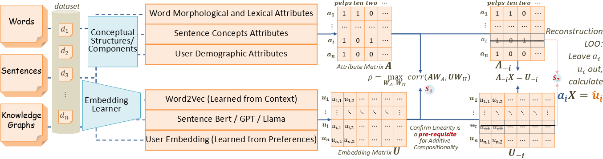

# Quantifying Compositionality in Embeddings

Implementation of **"Quantifying Compositionality of Classic and State-of-the-Art Embeddings"** - A framework for measuring compositional alignment between learned embeddings and structured attributes.

## 📊 Core Concept

For each entity (sentence/word/user), we have **TWO independent descriptions**:

1. **Embeddings** 📈 - Learned from distributional hypothesis (context/behavior)
   - Sentences → SBERT/GPT embeddings from contextual usage
   - Words → Word2Vec from co-occurrence patterns  
   - Users → Graph embeddings from interaction behavior

2. **Attributes** 🏷️ - Structured multi-hot vectors (demographics/syntax/concepts)
   - Sentences → Concept annotations (location, genre, etc.)
   - Words → Morphological features (prefixes, suffixes, roots)
   - Users → Demographics (age, gender, occupation)

**Our Goal**: Test if these two representations are compositionally aligned using:
- **CCA (Canonical Correlation Analysis)**: Measures linear correlation
- **Linear Decomposition**: Tests if embeddings can be reconstructed from attributes


*Figure: Two-step pipeline for quantifying compositionality between embeddings and attributes*

## 🚀 Quick Start

### Installation

```bash
# Clone repository
git clone https://github.com/yourusername/quantifying-compositionality.git
cd quantifying-compositionality

# Create virtual environment
python -m venv venv
source venv/bin/activate  # On Windows: venv\Scripts\activate

# Install dependencies
pip install -r requirements.txt
```

### Run Specific Experiments

```bash
# Choose which experiment to run:
python run_experiments.py --experiment sentence   # Sentence analysis only
python run_experiments.py --experiment word       # Word analysis only
python run_experiments.py --experiment kg         # KG analysis only (requires pre-trained embeddings)
python run_experiments.py --experiment layer-wise # Layer-wise SBERT analysis
python run_experiments.py --experiment all        # Run everything
```

### Basic Usage

```python
from attributes import SentenceAttributeExtractor
from embeddings import SentenceBERTExtractor
from compositionality import CompositionalityAnalyzer

# 1. Prepare your data
sentences = [
    "Book a table for dinner tomorrow",
    "Find flights from New York to London",
    "Show me movies playing tonight"
]

# 2. Extract attributes (structured representation)
attr_extractor = SentenceAttributeExtractor()
attributes, concept_names = attr_extractor.extract(sentences)

# 3. Generate embeddings (distributional representation)
embed_extractor = SentenceBERTExtractor()
embeddings = embed_extractor.extract(sentences)

# 4. Analyze compositionality
analyzer = CompositionalityAnalyzer()
results = analyzer.analyze_compositionality(embeddings, attributes)

print(f"Compositionality Score: {results['overall_compositionality_score']:.4f}")
```

## 📁 Project Structure

```
quantifying-compositionality/
│
├── attributes/              # Extract structured attributes
│   ├── base.py                 # Abstract base class
│   ├── sentence_attributes.py  # Extract concepts from sentences
│   ├── word_attributes.py      # Extract morphological features
│   └── kg_attributes.py        # Extract demographic attributes
│
├── embeddings/              # Generate distributional embeddings
│   ├── base.py                 # Abstract base class
│   ├── sentence_bert.py        # SBERT with layer-wise extraction
│   ├── word2vec.py             # Word2Vec embeddings
│   └── kg_embeddings.py        # Load pre-trained KG embeddings
│
├── compositionality/        # Analyze compositional alignment
│   ├── cca.py                  # Canonical Correlation Analysis
│   ├── linear_decomposition.py # Pseudo-inverse reconstruction
│   ├── metrics.py              # Evaluation metrics (cosine, L2, Hits@k)
│   └── analyzer.py             # Unified analysis pipeline
│
├── KG_embedding/            # Pre-trained KG embeddings
│   ├── 300_epochs_TransE_gpu34.pt
│   └── 300_epochs_DistMult_gpu34.pt
│
├── notebooks/               # Research notebooks
│   ├── example_sbert.ipynb     # SBERT analysis examples
│   ├── sentence_concept.ipynb  # Sentence compositionality
│   └── morphology_linear_decomposition.ipynb
│
├── example_embedding_pipeline.py     # Embedding extraction demo
├── example_compositionality_pipeline.py  # Full analysis demo
└── requirements.txt         # Python dependencies
```

## 🔬 Running Experiments

### Quick Start - Prerequisites Check

```bash
# Check setup for each experiment type
python check_sentence_setup.py  # For sentence experiment
python check_word_setup.py      # For word experiment

# Install required packages
pip install -r requirements.txt
```

### Overview of Experiments

| Experiment | Data Required | Model Required | Output |
|------------|--------------|----------------|--------|
| **Sentence** | Pre-prepared dialogue data (included) | SBERT (auto-download) | CCA & decomposition plots |
| **Word** | MorphoLEX dataset + GoogleNews Word2Vec | Manual download required | Morphology analysis plots |
| **KG** | MovieLens 1M + Pre-trained embeddings | Included in repo | User demographic plots |
| **Layer-wise** | None (uses demo sentences) | SBERT (auto-download) | Layer-by-layer analysis |

### Detailed Setup and Usage for Each Experiment

### 1. Sentence Experiment (Dialogue Slots)

#### ✅ Prerequisites
- **Data**: Pre-prepared dialogue data (✓ included in repo)
  - `data/sentence/user_texts.txt` - 2,458 dialogue sentences
  - `data/sentence/dialogue_data.csv` - Binary slot attributes
- **Model**: SBERT model (auto-downloads on first run)

#### 🚀 Quick Run
```bash
# Step 1: Verify setup
python check_sentence_setup.py

# Step 2: Run experiment
python run_experiments.py --experiment sentence --plot --verbose
```

#### 📊 What It Does
- Loads 2,458 pre-prepared dialogue sentences
- Extracts SBERT embeddings (layer 6 of all-MiniLM-L6-v2)
- Performs CCA with 15 components
- Groups by unique slot combinations for decomposition (~400 groups)
- Generates 4 analysis plots

#### 🎛️ Advanced Options
```bash
# Use different SBERT model or layer
python run_experiments.py --experiment sentence \
    --sbert-model sentence-transformers/all-mpnet-base-v2 \
    --layer 8 \
    --plot

# Custom analysis parameters
python run_experiments.py --experiment sentence \
    --cca-components 20 \
    --n-permutations 100 \
    --n-trials 100 \
    --plot
```

### 2. Word Experiment (Morphology)

#### ⚠️ Prerequisites (MANUAL DOWNLOAD REQUIRED)

1. **MorphoLEX Dataset** (✓ included in repo):
   - Already at: `data/MorphoLEX_en.xlsx`
   - If missing, download from: http://www.lexique.org/?page_id=250

2. **GoogleNews Word2Vec Model** (❌ MUST DOWNLOAD MANUALLY):
   - **File**: `GoogleNews-vectors-negative300.bin.gz` (~1.5 GB)
   - **Download from ONE of these**:
     - [Google Drive](https://drive.google.com/file/d/0B7XkCwpI5KDYNlNUTTlSS21pQmM/)
     - [Kaggle](https://www.kaggle.com/datasets/leadbest/googlenewsvectors)
     - [GitHub Mirror](https://github.com/mmihaltz/word2vec-GoogleNews-vectors)
   - **Save to**: `data/GoogleNews-vectors-negative300.bin.gz`

#### 🚀 Quick Run
```bash
# Step 1: Download GoogleNews model (REQUIRED - see links above)
# Save to: data/GoogleNews-vectors-negative300.bin.gz

# Step 2: Verify setup
python check_word_setup.py  # Will check both files exist

# Step 3: Run experiment
python run_experiments.py --experiment word --plot --verbose
```

#### 📊 What It Does
- Loads ~18,000 words from MorphoLEX
- Filters words with GoogleNews embeddings (~17,730 words)
- CCA analysis with 20 components on full dataset
- Linear decomposition on ~328 words with exactly 3 suffixes
- Generates 4 analysis plots

#### 📈 Expected Results
- **CCA**: Clear separation (real ~0.7-0.9 vs permuted ~0.1-0.2)
- **Cosine similarity**: ~0.78 real vs ~0.49 random
- **Hits@10**: ~0.93 real vs ~0.10 random
- **L2 loss**: Significantly lower for real data

#### ⚠️ Important
- **GoogleNews model is REQUIRED** - experiment won't run without it
- Model file can be `.bin.gz` or unzipped `.bin`
- Processing may take time due to large model size (3.4 GB uncompressed)

#### Input Format
Create a text file with one word per line:
```text
book
booking
booked
books
```

### 3. KG Experiment (MovieLens User Demographics)

#### ✅ Prerequisites
- **MovieLens 1M Dataset**: Download from [GroupLens](https://grouplens.org/datasets/movielens/1m/)
  - Extract to: `data/ml-1m/`
- **Pre-trained KG Embeddings**: (✓ included in repo)
  - `KG_embedding/300_epochs_TransE_gpu34.pt`
  - `KG_embedding/300_epochs_DistMult_gpu34.pt`

#### 🚀 Quick Run
```bash
# Step 1: Download and extract MovieLens 1M
wget https://files.grouplens.org/datasets/movielens/ml-1m.zip
unzip ml-1m.zip -d data/

# Step 2: Run experiment
python run_experiments.py --experiment kg --plot --verbose
```

#### 📊 What It Does
- Loads 6,040 MovieLens users with demographics
- Creates one-hot encoding for gender, age, occupation (30 features)
- Loads pre-trained TransE/DistMult embeddings
- Groups users by identical demographics
- Performs CCA and decomposition analysis

#### 🎛️ Options
```bash
# Use DistMult instead of TransE
python run_experiments.py --experiment kg \
    --kg-model distMult \
    --plot

# Include occupation features (default is gender+age only)
python run_experiments.py --experiment kg \
    --include-occupation \
    --plot
```
   - Extract to `data/ml-1m/` directory

2. **Pre-trained KG embeddings** in `KG_embedding/`:
   - `300_epochs_TransE_gpu34.pt` (6040 user embeddings)
   - `300_epochs_DistMult_gpu34.pt` (6040 user embeddings)

#### Basic Usage
```bash
# Run with TransE embeddings (default)
python run_experiments.py --experiment kg \
    --cca-components 10 \
    --plot

# Run with DistMult embeddings
python run_experiments.py --experiment kg \
    --kg-embedding distMult \
    --normalize-kg \
    --plot

# Full command with all parameters
python run_experiments.py --experiment kg \
    --movielens-dir data/ml-1m \
    --kg-embedding transE \
    --n-permutations 100 \
    --n-trials 30 \
    --cca-components 10 \
    --output-dir results \
    --plot
```

The system automatically:
- Loads all 6040 MovieLens users with demographics
- Creates one-hot encoding for gender, age, and occupation (30 features)
- Maps user IDs to embedding indices (user 1 → index 0, etc.)
- Groups users with identical demographics for analysis

### 4. Layer-wise Experiment (SBERT Layer Analysis)

#### ✅ Prerequisites
- **Data**: None (uses demo sentences)
- **Model**: SBERT (auto-downloads)

#### 🚀 Quick Run
```bash
# Analyze all layers of SBERT
python run_experiments.py --experiment layer-wise --plot --verbose
```

#### 📊 What It Does
- Uses demo sentences with concept attributes
- Extracts embeddings from each SBERT layer (0-6 for MiniLM)
- Computes compositionality score per layer
- Shows how compositionality evolves through network depth
- Typically peaks at middle layers (4-5)

#### 🎛️ Options
```bash
# Use different SBERT model
python run_experiments.py --experiment layer-wise \
    --sbert-model sentence-transformers/all-mpnet-base-v2 \
    --plot

# Faster analysis
python run_experiments.py --experiment layer-wise \
    --n-permutations 20 \
    --n-trials 20 \
    --plot
```

### 5. Run All Experiments

⚠️ **Note**: Requires all prerequisites from experiments 1-4 to be met.

```bash
# Run all experiments (if all data is prepared)
python run_experiments.py --experiment all --plot --verbose
```

## 📁 Output Files

All experiments save results to `output/` directory:
- **`.npz` files**: NumPy arrays with raw results
- **`.json` files**: Human-readable summaries (KG only)
- **`.png` files**: 4 plots per experiment:
  - CCA correlation curves
  - L2 loss distributions
  - Cosine similarity histograms
  - Retrieval accuracy (Hits@k)

## ⚙️ Common Parameters

| Parameter | Default | Description |
|-----------|---------|-------------||
| `--cca-components` | 10-20 | Number of CCA components |
| `--n-permutations` | 50 | Permutations for significance testing |
| `--n-trials` | 50 | Leave-one-out trials |
| `--plot` | False | Generate visualization plots |
| `--verbose` | False | Show detailed progress |
| `--output-dir` | output/ | Where to save results |

## 🔧 Troubleshooting

### Word Experiment Issues
- **"GoogleNews model not found"**: Must manually download from links above
- **SSL certificate errors**: Download manually using browser
- **Memory errors**: Model is 3.4 GB - ensure sufficient RAM

### Sentence Experiment Issues
- **Data files missing**: Ensure `data/sentence/` contains both required files
- **SBERT download fails**: Will auto-retry, or install manually with `pip install sentence-transformers`

### General Issues
- **Import errors**: Run `pip install -r requirements.txt`
- **CUDA/GPU errors**: PyTorch will fall back to CPU automatically
- **Permission errors**: Check write permissions for `output/` directory

## 📊 Interpreting Results

### Good Compositionality (Expected)
- **CCA**: Real correlations >> permuted correlations
- **Cosine similarity**: Real > 0.7, permuted < 0.5
- **L2 loss**: Real < permuted
- **Hits@k**: Real > 0.8, permuted < 0.2

### Poor Compositionality
- Real and permuted results are similar
- P-values > 0.05 (not statistically significant)
- Overall compositionality score < 0.3

## 📊 Understanding Results

The analysis produces several key metrics:

### Linearity (CCA)
- **Canonical Correlations**: Strength of linear alignment (0-1, higher is better)
- **Mean Correlation**: Average correlation across components
- **P-values**: Statistical significance

### Additive Generalization (Linear Decomposition)
- **Cosine Similarity**: How well reconstructed embeddings match originals (0-1)
- **L2 Loss**: Reconstruction error (lower is better)
- **Leave-One-Out**: Generalization to unseen combinations

### Overall Score
The compositionality score indicates the alignment between embeddings and attributes. Higher scores indicate stronger compositional structure.

## 🛠️ Advanced Usage

### Custom Attribute Extraction

```python
from attributes.base import AttributeExtractor

class CustomAttributeExtractor(AttributeExtractor):
    def extract(self, data):
        # Your custom attribute extraction logic
        attributes = your_extraction_method(data)
        return attributes, attribute_names
```

### Detailed Analysis Configuration

```python
from compositionality import CompositionalityAnalyzer

analyzer = CompositionalityAnalyzer(
    cca_components=15,              # Number of CCA components
    decomposition_method='pseudo_inverse',  # or 'lstsq'
    random_seed=42                  # For reproducibility
)

results = analyzer.analyze_compositionality(
    embeddings=embeddings,
    attributes=attributes,
    methods=['cca', 'decomposition', 'metrics'],  # Choose methods
    n_permutations=100,             # Permutation tests for significance
    n_trials=100,                   # Leave-one-out trials
    group_by_attributes=True,       # Group identical attributes
    verbose=True                    # Show progress
)

# Access detailed results
print(f"CCA correlations: {results['cca']['real_correlations']}")
print(f"Cosine similarity: {results['decomposition']['real_cosine_similarity']:.4f}")
print(f"Hits@5 accuracy: {results['metrics']['hits@5']:.4f}")
print(f"Statistical significance: p={results['cca']['overall_p_value']:.4f}")
```

### Visualization Options

```python
# Generate comprehensive visualization
fig = analyzer.plot_results(results, save_path='analysis.png')

# The plot includes:
# - CCA correlation curves (real vs permuted)
# - L2 loss distributions
# - Cosine similarity histograms
# - Retrieval accuracy (Hits@k)
# - P-values for significance tests
# - Overall compositionality scores
```

## 📈 Key Findings from Paper

Our experiments demonstrate:

1. **Sentence Embeddings** (SBERT, GPT, LLaMA):
   - Cosine similarity: ~0.78 for real vs ~0.49 for random
   - Compositionality peaks in middle layers (4-5 for SBERT)

2. **Knowledge Graph Embeddings**:
   - CCA correlation increases 1.5× from early to late training
   - Strong correlation with demographic attributes

3. **Word Embeddings**:
   - Successfully decompose into morphological components
   - Both semantic and syntactic information captured

## 🔧 API Reference

### Attribute Extractors
```python
# Sentence attributes (concepts)
from attributes import SentenceAttributeExtractor
extractor = SentenceAttributeExtractor(
    concept_vocabulary=['location', 'time', 'service', 'genre']
)
attributes, names = extractor.extract(sentences)

# Word attributes (morphology)
from attributes import WordAttributeExtractor
extractor = WordAttributeExtractor(attribute_type='morphological')
attributes, features = extractor.extract(words)

# KG attributes (demographics)
from attributes import KGAttributeExtractor
extractor = KGAttributeExtractor(attribute_type='demographic')
attributes, demographics = extractor.extract(entities)
```

### Embedding Extractors
```python
# SBERT with layer-wise extraction
from embeddings import SentenceBERTExtractor
extractor = SentenceBERTExtractor(model_name='all-MiniLM-L6-v2')
embeddings = extractor.extract(sentences, layer=4)  # Specific layer
all_layers = extractor.extract_all_layers(sentences)  # All layers

# Word2Vec embeddings
from embeddings import Word2VecExtractor
extractor = Word2VecExtractor(pretrained_model='glove-wiki-gigaword-100')
embeddings = extractor.extract(words)

# KG embeddings (pre-trained)
from embeddings import KGEmbeddingLoader
loader = KGEmbeddingLoader(model_type='TransE')
embeddings = loader.extract(entity_ids)
```

### Compositionality Analysis
```python
from compositionality import CompositionalityAnalyzer

# Initialize analyzer
analyzer = CompositionalityAnalyzer(
    cca_components=10,
    decomposition_method='pseudo_inverse'
)

# Run analysis
results = analyzer.analyze_compositionality(
    embeddings=embeddings,
    attributes=attributes,
    methods=['cca', 'decomposition', 'metrics'],
    n_permutations=100,
    n_trials=100
)

# Visualize
analyzer.plot_results(results, save_path='results.png')
```

## 📚 Citation

If you use this code in your research, please cite:

```bibtex
@article{guo2024quantifying,
  title={Quantifying Compositionality of Classic and State-of-the-Art Embeddings},
  author={Guo, Zhijin and Xue, Chenhao and Xu, Zhaozhen and Bo, Hongbo and Ye, Yuxuan and Pierrehumbert, Janet B. and Lewis, Martha},
  journal={arXiv preprint},
  year={2024}
}
```

## 🐛 Troubleshooting

### Common Issues

1. **Import errors**: Make sure you're in the project root and have activated the virtual environment
2. **Missing OpenAI key for GPT**: Set `export OPENAI_API_KEY="your-key"`
3. **Memory issues with LLaMA**: Use `load_in_8bit=True` parameter
4. **Data not found**: Check `data_dir` paths in loaders

### Getting Help

- Run `python example_compositionality_pipeline.py` for a complete demo
- Check module READMEs: [attributes/](attributes/), [embeddings/](embeddings/), [compositionality/](compositionality/)
- Review notebooks in [notebooks/](notebooks/) for research examples
- Open an issue on GitHub for bugs or questions

## 📄 License

MIT License - see LICENSE file for details.

## 🙏 Acknowledgments

We thank the authors of sentence-transformers, transformers, and scikit-learn libraries.